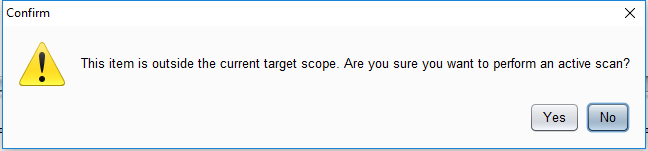
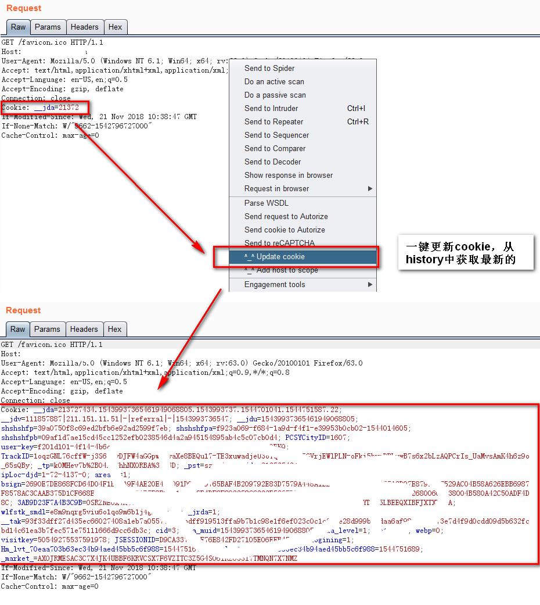
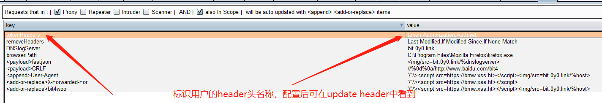
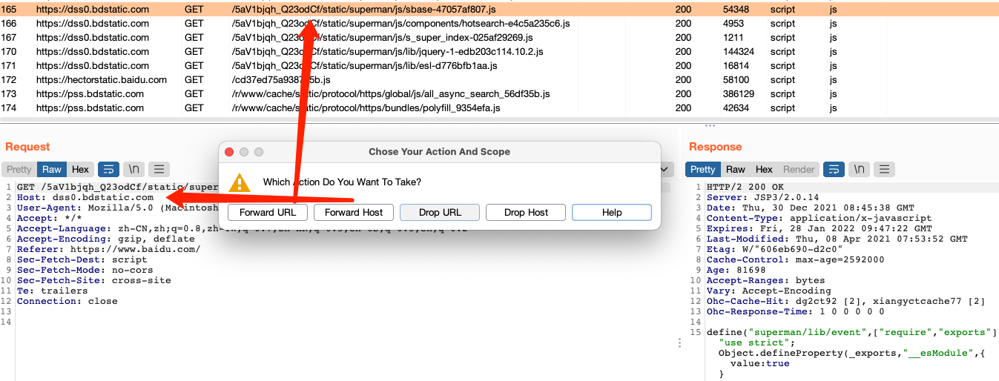
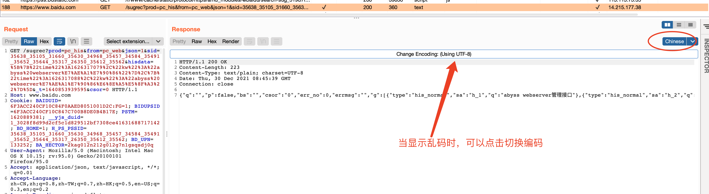
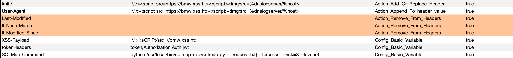
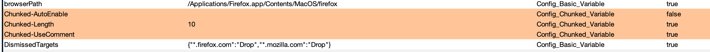
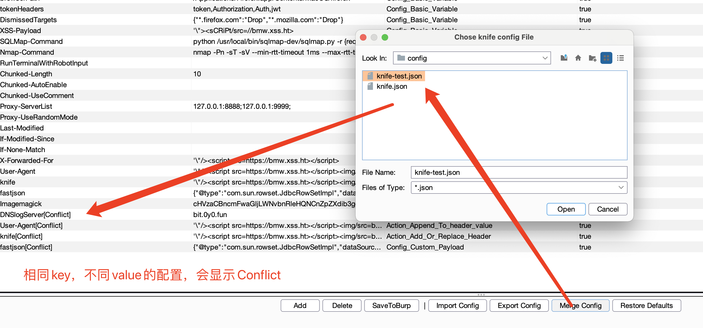

[](https://github.com/ellerbrock/open-source-badges/ ) [](https://opensource.org/licenses/mit-license.php)

## knife

[中文](https://github.com/bit4woo/knife/blob/master/README.md)

Project address: https://github.com/bit4woo/knife

Project introduction: knife is a Burp Suite plug-in, the main purpose is to make some small improvements to Burp to make it more convenient to use. It's like using a **knife** to make a small carving on Burp, hence the name "knife".

Project author: [bit4woo](https://github.com/bit4woo) Welcome to communicate with me

Video tutorial: https://www.bilibili.com/video/bv1BC4y1s7nS

## Precautions

**Before using the plug-in, please modify the configuration to your own Payload! ! ! Especially the configuration whose type starts with "Action"! ! ! **

**After installing the new version of the plug-in, please refer to the "Merge Config" section to update the configuration! ! ! **

## installation method

1. Visit https://github.com/bit4woo/knife/releases

2. Download the latest jar package

3. Install the plug-in as follows


4. If you want to use the latest features, you can use the following methods to pack it yourself.

```bash
git clone https://github.com/bit4woo/knife
cd knife
mvn package
```


## Features

### 1. Right-click menu


#### 1. Add Host To Scope

Add all hosts of the currently selected request to the scope. Burp adds the URL of the current request to the scope by default.

Usage scenario: [such as active scanning] When using burp to actively scan a URL, if the URL is not in the scope, click to confirm. If you use this function in advance when testing a target website, you can avoid clicking the confirmation button multiple times.



#### 2. Update Cookie

One-click to update the cookie of the current data packet, mainly used for repeater.

Usage scenario: [such as vulnerability retest] When we retest a vulnerability that was long ago, we often need to update the cookie value to make the data packet effective. In this case, as long as there is the latest cookie corresponding to the request in the history of burp, one-click update can be completed in the repeater.

Implementation principle: From the burp history, flashback search for the same data packet as the host of the current data packet. If a cookie is found and there is a cookie, the cookie will be used to replace the cookie of the current data packet. If the request traffic of different accounts of the same system passes through the current burp during the test, you need to pay attention. Of course, if you know this, it can also help you test unauthorized vulnerabilities.



#### 3. Update Header

Similar to the "update cookie" function, its function is also used to update the user ID, because the user ID of some websites is not stored in the cookie, but exists as a header.

The user can configure the value of tokenHeaders in the graphical configuration interface to customize the header with the user ID according to the request encountered. Several possible header names token, Authorization, Auth, jwt have been pre-set.

Corresponding configuration items:




#### 4. Set Cookie

To the response packet of the current request, add the header "set cookie" to make subsequent requests of the entire website carry these cookies.

Usage scenario: When we use an IP address to visit a web, due to the limitation of the scope of the cookie, most of them will not bring a valid cookie. But we know that it is a site of a certain domain (for example, it is a certain website of *.jd.com), and we can actively set him the same cookie as a certain site through the Set Cookie method (for example, the cookie of www.jd.com) ).

#### 5. Open With Bsrowser

Use the browser to open the currently selected URL or the currently requested URL.

Firstly, judge whether the currently selected content is a valid URL, if it is, then open the selected URL, if otherwise, open the currently requested URL.

The user can configure the browser used to open the URL. If the value is empty or the configured browser path is wrong, the system default browser will be used to open it.

Corresponding configuration items:


The browser opens the demo:


#### 6. Insert Payload

You can set personal common payloads in the configuration.

Config_Custom_Payload: The payload in string format. The value of the payload can contain 2 variables: %host and %DNSlogServer, which will be replaced with corresponding values when using the payload.

Config_Custom_Payload_Base64: Base64 format payload. When the payload contains special characters such as line breaks, or is in a binary file format, you can first convert the content to base64 format and then set it. Such as the Payload of the ImageMagic vulnerability.


Corresponding configuration items


#### 7. Insert Payload For All

One-click to insert a custom Payload into the current data packet [All non-digital and non-cookie parameters]. The function is similar to Insert Payload, except that this function attempts to perform the same action on multiple parameters.

#### 8. Dismissed

Let some useless request packets that you don't want to see disappear from your eyes!

Forward URL: If you encounter the current URL again in the future, it will be automatically passed (Forward) without interception.

Forward Host: If you encounter any URL of the current Host again in the future, it will be automatically passed (Forward) without interception.

Drop URL: If the current URL is encountered again in the future, it will be automatically dropped and the request will not be sent.

Drop Host: If you encounter any URL of the current Host again in the future, it will be automatically dropped and the request will not be sent.

The URL that is automatically dropped can be used with the filter "Hide items without responses" at the top of History to prevent it from being displayed in History.



Corresponding configuration items:

```
DismissedTargets {"*.firefox.com":"Drop","*.mozilla.com":"Drop"} Config_Basic_Variable true
```


#### 9. Run SQLMap

Run sqlmap on the current data package with one click, modify the value of SQLMap-Command configuration, you can modify it according to your own habits.

```
python /usr/local/bin/sqlmap-dev/sqlmap.py -r {request.txt} --force-ssl --risk=3 --level=3


The {request.txt} in it will be replaced by the file of the current packet during execution
```


In addition, calling burp external programs such as SQLMap and Nmap are essentially executing system commands. The RunTerminalWithRobotInput option will affect the way the command is executed.

**When RunTerminalWithRobotInput is true**, it will try to open a command line terminal first, and then execute the command by simulating keyboard input. The advantage is: the effect is similar to human interaction, and a history record will be left in the command line terminal. The disadvantage is that this method is affected by the response speed of the program and whether the clipboard is successfully read and written. It is not very stable, and chaotic errors may occur in some cases.

**When RunTerminalWithRobotInput is false**, all commands will be written into the bat file first, and then the bat file will be run to implement system commands. The advantages and disadvantages are just the opposite: stable functions, no command line history is left for major events.

You can modify the corresponding configuration according to your own needs.

```
RunTerminalWithRobotInput Config_Basic_Variable false
```


#### 10. Run Nmap

Similar to "Run SQLMap", Nmap is called to scan the currently selected and requested Host.

Corresponding configuration items:


### Two, data packet display Tab

#### 1. U2C Tab

Convert Unicode characters into Chinese, such as `\u4e2d\u6587`-->`Chinese` The display effect is related to the encoding setting in the display settings of burp. If the display is abnormal, you can try to modify the encoding setting.


#### 2. Chinese Tab

When the data packet contains Chinese, if the default display is garbled, you can use this Tab to support the use of different encodings to display the content.



### Three, request package automatic modification

#### 1. Automatically delete

Some headers in the request, such as Last-Modified, If-Modified-Since, If-None-Match. etc., they all control the client-side caching. In many cases, their existence will prevent repeated requests from returning true. content. So we can configure automatic deletion, as shown in the figure below.

Of course, you can also add new configuration items to delete other headers, the key is the name of the header you want to delete, the value can be left blank, and the type is selected as "Action_Remove_From_Headers".

Note that the logic of automatic deletion is effective for all requests.



#### 2. Automatically add or modify

When the type is "Action_Add_Or_Replace_Header": If the original header exists, replace the original value with the value in the configuration. If it does not exist, directly add a header with the key and value in the configuration.

When the type is "Action_Append_To_Header_value": Make sure that the original value exists, and attach the content in value at the end of the original value.


Effect demonstration:


#### 3. The scope of automatic addition or modification

That is, the configuration item whose type is "Action_Add_Or_Replace_Header" and type is "Action_Append_To_Header_value" is affected.


The basic logic of the control condition is "The pair comes from ([Yes/No] proxy or [Yes/No] scanner or [Yes/No] repeater or [Yes/No] intruder) ** and ** is also included in [Yes] /No] Request for modification in scope".

For example, the logic shown in the above figure is: to perform packet changes to requests from the proxy and in the scope.

#### 4. Request to use proxy

The request can be made to use the upstream proxy, and the random mode is supported, that is, a proxy is randomly selected for each request.


#### 5. Automatic use of chunked encode




## Configuration operation

### 1. Configuration editing

Add adds a new configuration item; Delete deletes a configuration item;

After adding, select the corresponding Type, choose whether to enable the configuration, or add the role of comment annotation configuration.


### 2. Export Config

Save the current configuration to a JSON file. After completing the satisfactory configuration, it is recommended to save and backup in time.


### 3. Import Config

Importing the configuration will completely clear the current configuration and completely use the configuration in the new file.


### 4. Merge Config

When updating the plug-in (using the new version), it is recommended to follow the procedure below:

1. Save the configuration of the old version

2. Install the new plug-in version

3. Click "Restore Defaults" to initialize the current configuration to default values.

4. Click "Merge Conig" and select the old configuration file to merge the configuration.

5. To deal with the conflicting value, select the original item or the conflicting item to delete it, and it will be updated automatically. If there are no conflicting items, you don't need to deal with it.



### 5. Configure cache SaveToBurp

Save the current configuration to the burp cache, and it will be automatically loaded next time you start burp. It is automatically saved by default.

## Contributions welcome

If you have better suggestions or comments, please [submit](https://github.com/bit4woo/knife/issues)

## Acknowledgements

Thanks to [jetbrains](https://www.jetbrains.com/) for the open source license!

