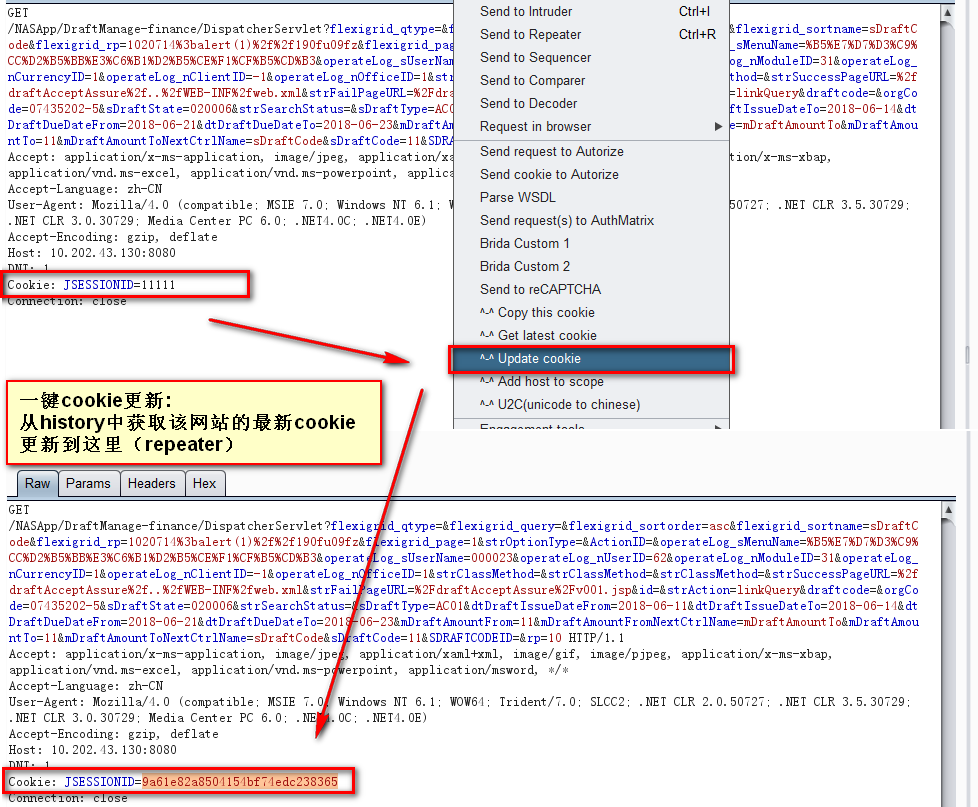
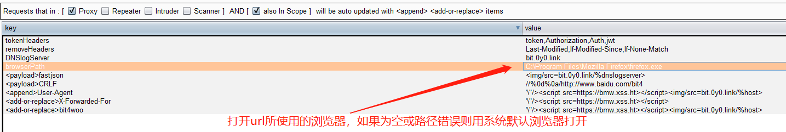
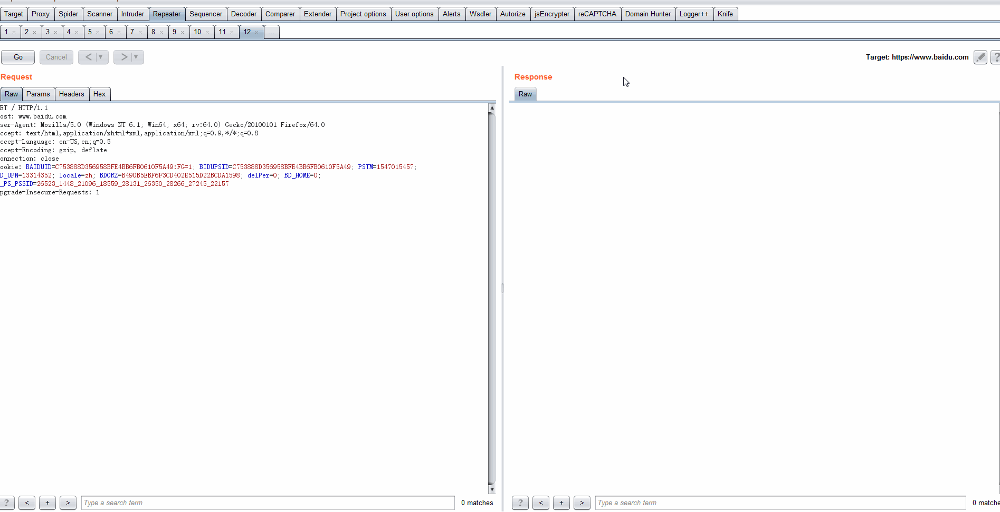
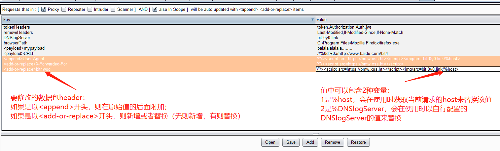
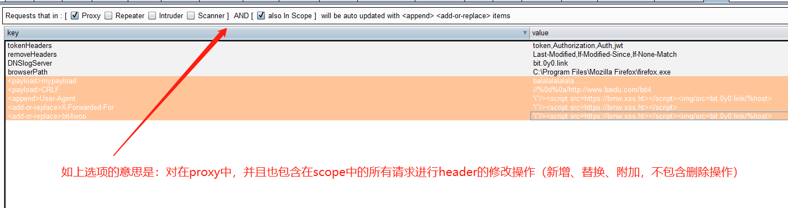

  

### [knife](https://github.com/bit4woo/knife)插件详细使用手册

插件的主要的目的是对burp做一些小的改进，更加方便使用。就像用一把**小刀**对其进行小小的雕刻。

### 作者

[bit4woo](https://github.com/bit4woo)

### 功能

##### 右键菜单

1. update cookie

   一键更新当前数据包的cookie，主要用于repeater。

   使用场景【比如漏洞复验】：当我们复验一个很早以前的漏洞，往往需要更新其中的cookie值使得数据包生效。这种情况下只要通过burp的history中有最新的cookie，在repeater中即可完成一键更新。

   原理：从history中，倒叙查找与当前数据包host相同的数据包，如果找到并且有cookie，将使用该cookie替换当前数据包的cookie。如果测试时同一个系统的不同账户的请求流量都经过当前burp则需要注意，当然，如果你对此了然于胸也可帮助你测试越权漏洞。

   

1. add host to scope

   将当前选中的请求的所有host都加入到scope当中，burp默认是讲当前请求的URL加入到scope中。

   使用场景【比如主动扫描】：当使用burp对一个URL进行主动扫描时，如果这个URL不在scope中需要点击确认。如果在测试一个目标网站站时，提前使用该功能，能避免多次重复点击确认按钮。

   

2. update header

   这是对update cookie的增强，因为有些网站的用户表示并不是存在cookie中，而是以某个header存在。

   用户可以自己根据遇到的请求，在图形配置界面配置tokenHeaders的值来自定义带用户标识的header。默认已经加了几个自己遇到的header头名称token,Authorization,Auth,jwt。

   

   

3. open with browser

   使用浏览器打开当前选中的URL或者当前请求的URL。优先判断当前选中内容是否是有效的URL，如果是则打开选中的URL，如果否则打开当前请求的URL。

   用户可以配置打开URL所使用的浏览器，如果值为空或者配置的浏览器路径有错，则会使用系统默认浏览器打开。

   

   浏览器打开演示：

   

4. hackbar++

   该菜单集成了 [Hackbar](https://github.com/d3vilbug/HackBar) ，可以在当前请求中插入payload进行手动测试。

   该菜单最主要的改进是：可以配置自己常用的payload，配置后可以在hackbar++的custom payload中看到。

   另外，payload的值中可以包含2个变量：分别是%host和%DNSlogServer，会在使用payload时使用对应的值替换。

   

6. Set cookie

   对当前请求的响应包的header添加set cookie的header，使整个站的后续请求都带上这些cookie。

   使用场景：当我们使用IP地址访问一个web的时候，由于cookie的域的限制，大多都不会带上cookie。但是当我们是知道它是某个域的站点（比如它是*.jd.com），可以通过这个方法主动给他设置与某个站点相同的cookie（比如www.jd.com的cookie）。

##### Tab

1. U2C

   将Unicode形式的字符转换为中文，比如 `\u4e2d\u6587`-->`中文` 显示效果和burp的显示设置中编码的设置有关，如果显示异常可以尝试修改编码设置。

   

##### 请求包自动修改

1. 插件会自动删除请求中的一些header头，比如 Last-Modified,If-Modified-Since,If-None-Match. 等等，它们都是控制客户端缓存的，很多时候它们的存在会让重复的请求不会返回真实内容。当然也可以通过修改removeHeaders的值来控制要删除的其他header。注意，这部分功能是对整个burp生效的。

2. 自动新增或者修改某些header头，它的基本逻辑是：

   首先：根据图形界面上方的勾选配置，判断当前请求是否符合配置条件。如果符合，执行修改操作。

   其次：请求数据包的修改操作逻辑如下，如果以`<append>`开头则在原始值的末尾附加值，如果以`<add-or-replace>`开头，则新增或完全替换其值。

   再者：控制条件的基本逻辑是 “对存在于（【是/否】proxy 或者【是/否】 scanner或者【是/否】repeater或者【是/否】intruder）中**并且**也包含在【是/否】scope中的请求进行修改操作“。比如：

   

   

3. 对请求使用代理。
4. 自动使用chunked encode 编码，绕过waf。

如有更好的建议或者意见，欢迎[提交](https://github.com/bit4woo/knife/issues)

