[](https://github.com/ellerbrock/open-source-badges/)  [](https://opensource.org/licenses/mit-license.php)

## knife

[English](https://github.com/bit4woo/knife/blob/master/README-en.md)

项目地址：https://github.com/bit4woo/knife

项目简介：knife是一个Burp Suite插件，主要目的是对Burp做一些小的改进，让使用更方便。就像用一把**小刀**对Burp进行小小的雕刻，故名“knife”。

项目作者：[bit4woo](https://github.com/bit4woo) 欢迎与我交流

视频教程：https://www.bilibili.com/video/bv1BC4y1s7nS

## 注意事项

**使用插件前，请先修改配置为自己的Payload！！！尤其是类型以“Action”开头的配置！！！**

**安装新版本插件后，请参考”配置合并（Merge Config）“部分进行配置更新！！！**

## 安装方法

1、访问https://github.com/bit4woo/knife/releases

2、下载最新jar包

3、如下方法安装插件

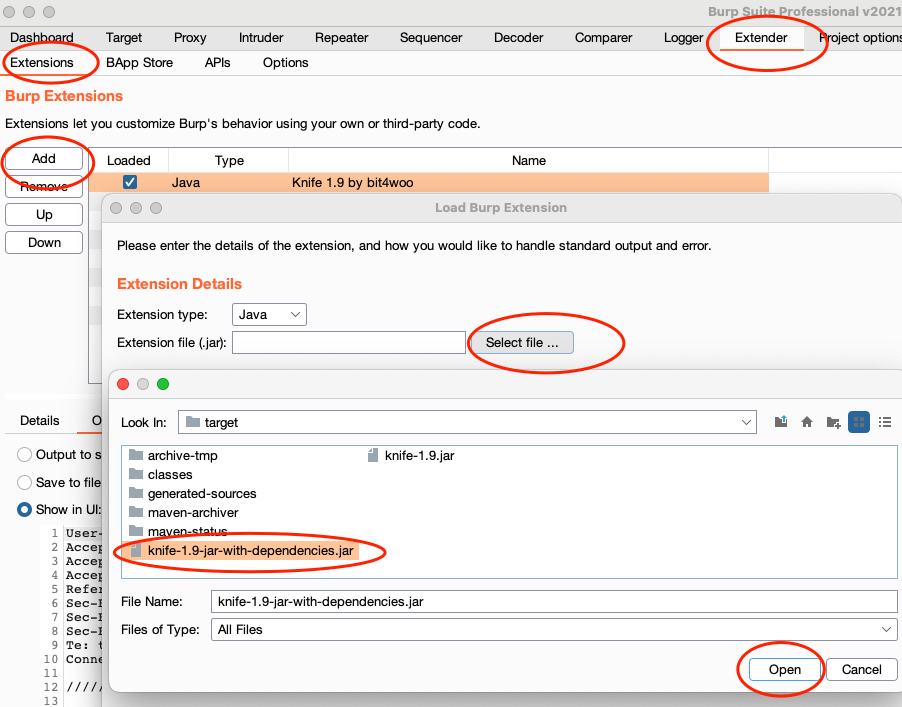

## 使用最新版

如果你想使用最新的功能，可以使用如下方法：

### 1、自行打包

```bash
git clone https://github.com/bit4woo/knife
cd knife
mvn package
```


### 2、通过github action下载

访问项目的Action页面 https://github.com/bit4woo/knife/actions。找到最新成功的构建，绿色✔的成功的构建，红色×是失败的构建。

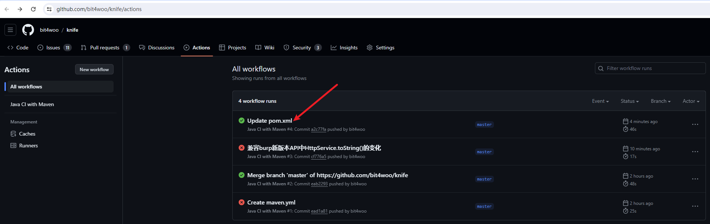

点击最新成功的构建链接，找到底部的 “jar-with-dependencies”，即可下载对应的jar包。

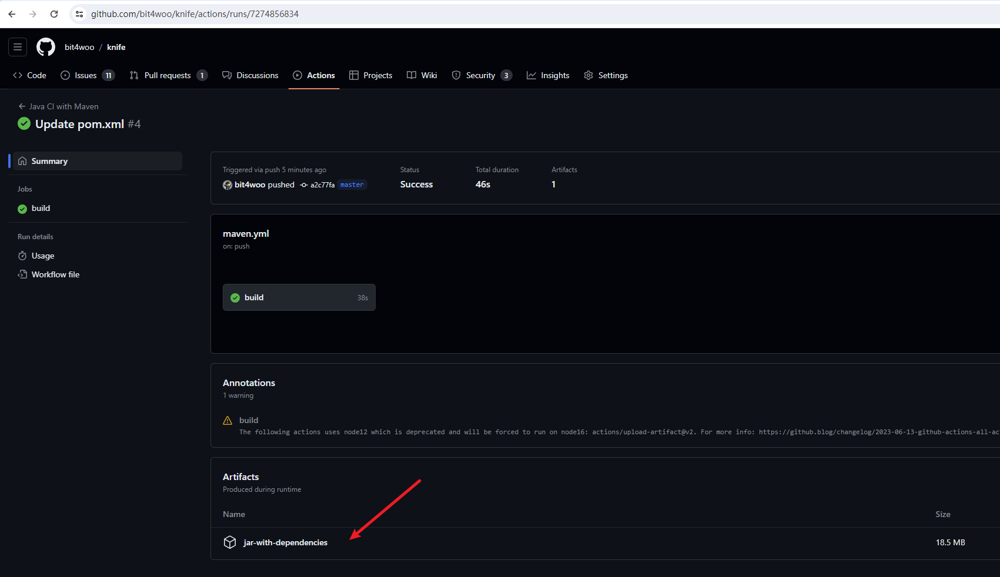


## 功能介绍

### 一、右键菜单


#### 1、Add Host To Scope

将当前选中的请求的所有host都加入到scope当中，burp默认是将当前请求的URL加入到scope中。

使用场景：【比如主动扫描】当使用burp对一个URL进行主动扫描时，如果这个URL不在scope中需要点击确认。如果在测试一个目标网站站时，提前使用该功能，能避免多次重复点击确认按钮。


#### 2、Update Cookie

一键更新当前数据包的cookie，主要用于repeater。

使用场景：【比如漏洞复验】当我们复验一个很早以前的漏洞，往往需要更新其中的cookie值使得数据包生效。这种情况下只要burp的history中有对应请求的最新的cookie，在repeater中即可完成一键更新。

实现原理：从burp history中，倒叙查找与当前数据包host相同的数据包，如果找到并且有cookie，将使用该cookie替换当前数据包的cookie。如果测试时同一个系统的不同账户的请求流量都经过当前burp则需要注意，当然，如果你对此了然于胸也可帮助你测试越权漏洞。


####  3、Update Header

与”update cookie“功能类似，它的作用也是用于更新用户标识，因为有些网站的用户标识并不是存在cookie中，而是以某个header存在。

用户可以自己根据遇到的请求，在图形配置界面配置tokenHeaders的值来自定义带用户标识的header。已预先设置了几个可能的header头名称token,Authorization,Auth,jwt。

对应的配置项：


#### 4、Set Cookie

对当前请求的响应包，添加”set cookie“这个header，使整个网站的后续请求都带上这些cookie。

使用场景：当我们使用IP地址访问一个web的时候，由于cookie的作用域的限制，大多都不会带上有效cookie。但是我们知道它是某个域的站点（比如它是*.jd.com的某个网站），可以通过Set Cookie方法主动给他设置与某个站点相同的cookie（比如www.jd.com的cookie）。

方法一：可以直接输出cookie值

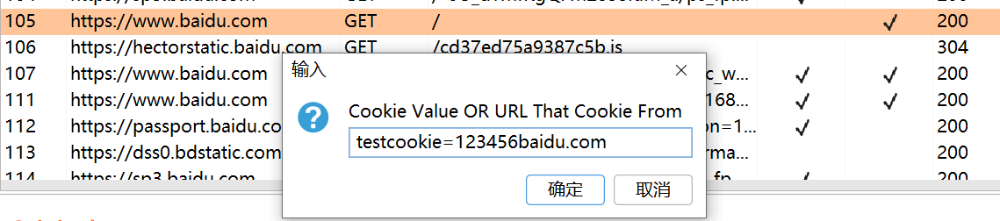

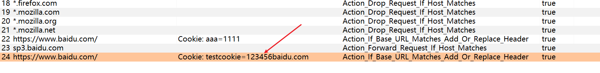

方法二：输入域名，根据域名查找历史记录中的cookie值

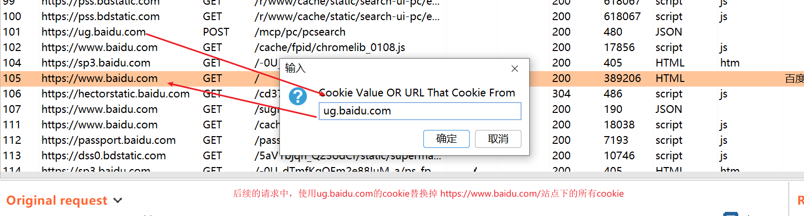

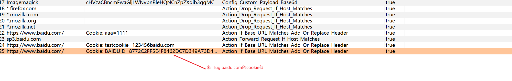

#### 5、Open With Bsrowser

使用浏览器打开当前选中的URL或者当前请求的URL。

优先判断当前选中内容是否是有效的URL，如果是则打开选中的URL，如果否则打开当前请求的URL。

用户可以配置打开URL所使用的浏览器，如果值为空或者配置的浏览器路径有错，则会使用系统默认浏览器打开。

对应的配置项：


浏览器打开演示：

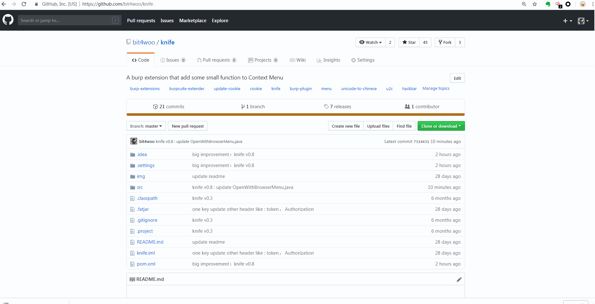

#### 6、Insert Payload

可以在配置中设置个人的常用payload。

Config_Custom_Payload：字符串格式的payload，payload的值中可以包含2个变量：分别是%host和%DNSlogServer，会在使用payload时使用对应的值替换。

Config_Custom_Payload_Base64：base64格式的payload，当payload包含换行等特殊字符，或者是二进制文件等格式，可以先将内容转换成base64格式然后设置。比如ImageMagic漏洞的Payload。

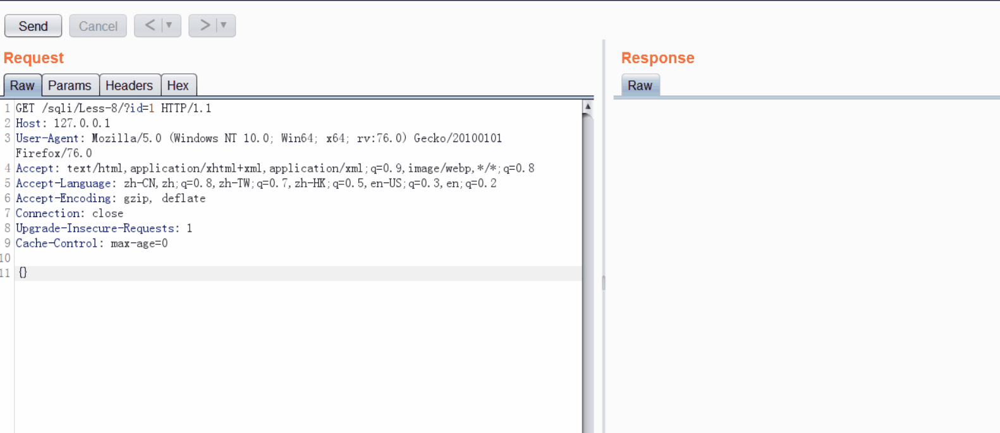

对应的配置项


#### 7、Insert Payload For All

原先的菜单名称是【Insert XSS】，现在对其做了加强。原先是只能批量插入XSS Payload到多个参数值，现在是任意Payload都可以。

一键对当前数据包中【非数字型和非cookie的所有参数】插入自定义的Payload。与Insert Payload的功能类似，只是这个功能尝试对多个参数执行相同的动作而已。

#### 8、Dismiss

让一些无用的、不想看到的请求包从眼前消失！

Action_Drop_Request_If_Host_Matches   如果后续再次遇到当前Host的任何URL，自动丢弃（drop），不发送请求。

Action_Drop_Request_If_URL_Matches   如果后续再次遇到当前的URL，自动丢弃（drop），不发送请求。

Action_Drop_Request_If_Keyword_Matches 如果后续的URL中包含制定的关键词，自动丢弃（drop），不发送请求。

Action_Forward_Request_If_Host_Matches   如果后续再次遇到当前Host的任何URL，自动放过（Forward），不做拦截。

Action_Forward_Request_If_URL_Matches  如果后续再次遇到当前的URL，自动放过（Forward），不做拦截。

Action_Forward_Request_If_Keyword_Matches 如果后续的URL中包含制定的关键词，自动放过（Forward），不做拦截。

自动Drop掉的URL，可以配合History上方的过滤器”Hide items without responses“，让其不显示在History中。


对应的配置项：

```
18	*.firefox.com		Action_Drop_Request_If_Host_Matches	true	
19	*.mozilla.com		Action_Drop_Request_If_Host_Matches	true	
20	*.mozilla.org		Action_Drop_Request_If_Host_Matches	true	
21	*.mozilla.net		Action_Drop_Request_If_Host_Matches	true	
```

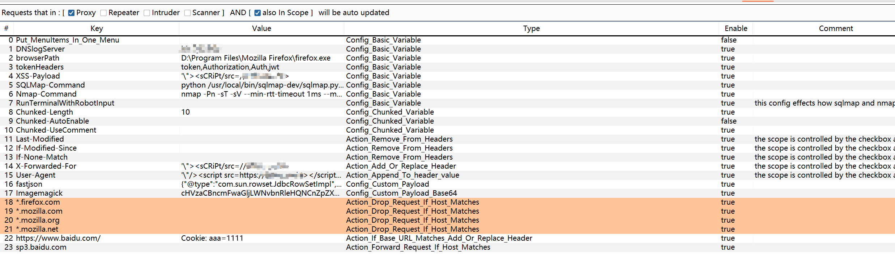

#### 9、Run SQLMap

一键对当前数据包跑sqlmap，修改SQLMap-Command配置的值可以根据自己的习惯进行修改。

```
python /usr/local/bin/sqlmap-dev/sqlmap.py -r {request.txt} --force-ssl --risk=3 --level=3


其中的{request.txt} 会在执行时被当前数据包的文件所替换
```

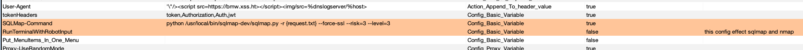

另外调用SQLMap、Nmap等burp外部程序，本质都是执行系统命令。而RunTerminalWithRobotInput选项会影响命令执行的方式。

**当RunTerminalWithRobotInput 为 true的时候**，会尝试先开启一个命令行终端，然后以模拟键盘输入的方式进行命令的执行。优点是：效果类似人为交互，会在命令行终端留下历史记录。缺点是：这个方式受程序响应速度、剪切板读写是否成功的影响，不是很稳定，某些情况会出现混乱错误。

**当RunTerminalWithRobotInput 为 false的时候**，会将所有命令先写入bat文件，然后运行bat文件，来实现系统命令的执行。优缺点刚好相反：功能稳定，大事不会留下命令行历史记录。

可根据自己的需求修改对应的配置。

```
RunTerminalWithRobotInput		Config_Basic_Variable	false	
```


#### 10、Run Nmap

和”Run SQLMap“类似，调用Nmap，对当前选择请求的Host进行扫描。

对应的配置项：


### 二、数据包显示Tab

#### 1、Chinese Tab

A：将Unicode形式的字符转换为中文，比如 `\u4e2d\u6587`-->`中文` 显示效果和burp的显示设置中编码的设置有关，如果显示异常可以尝试修改编码设置。

B：当数据包中包含中文，如果默认显示为乱码，可以使用这个Tab，支持使用不同的编码来显示内容。


Unicode测试URL

https://passport.baidu.com/v2/api/getqrcode

https://aiqicha.baidu.com/index/getCPlaceAjax


### 三、由ToolFlag和Scope控制范围的请求包自动修改

<u>**数据包处理规则的作用顺序：**</u>

<u>**越新的规则越先被使用，因为它更能代表使用者的最新诉求和意图！**</u>

控制条件的基本逻辑是 “对来自于（【是/否】proxy 或者【是/否】 scanner或者【是/否】repeater或者【是/否】intruder）中**并且**也包含在【是/否】scope中的请求进行修改操作“。

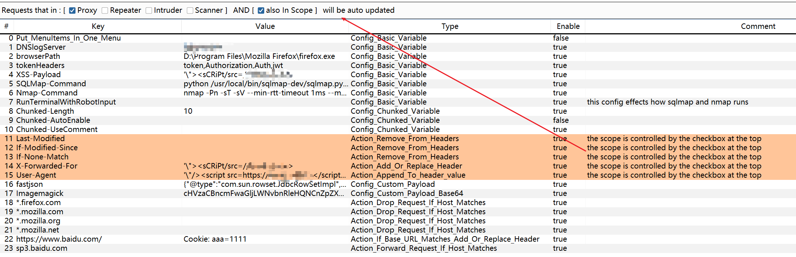

比如，上图所示的逻辑是：对来自proxy并且在scope的中请求，执行数据包更改。

#### 1、自动删除

请求中的一些header头，比如 Last-Modified,If-Modified-Since,If-None-Match. 等等，它们都是控制客户端缓存的，很多时候它们的存在会让重复的请求不会返回真实内容。所以我们可以配置自动删除，如下图。

当然也可以添加新的配置项来删除其他header，key是想要删除的header名称，值留为空即可，type选择为”Action_Remove_From_Headers“。

注意，自动删除的逻辑是对所有请求生效的。


#### 2、自动新增或者修改

当type是”Action_Add_Or_Replace_Header“时：如果原始header存在，用配置中的value值替换原始值。如果不存在，直接以配置中的key和value添加一个header。

当type是”Action_Append_To_Header_value“时：确信原始值存在，在原始值末尾附上value中的内容。

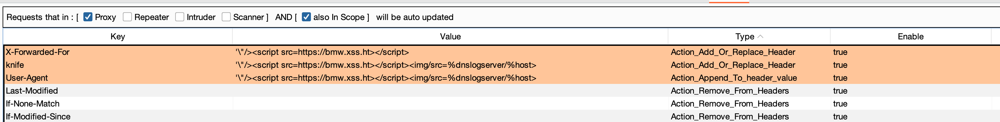

效果演示：

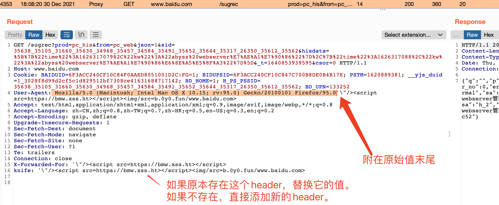

### 四、由Base URL控制范围的请求包自动修改

执行的修改操和以上相同，不同的是控制范围的方式。当使用set cookie功能后，会自动添加响应的规则，当然也可以手动添加。

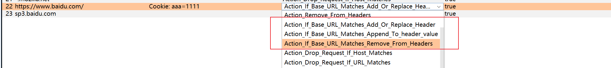

上图对应的修改效果。

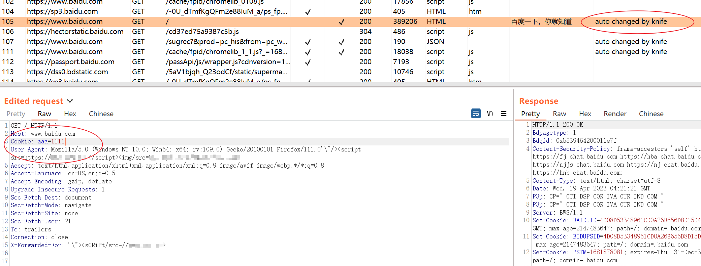


#### 5、自动使用chunked encode


## 配置操作

### 1、配置编辑

Add 新增一个配置项；Delete删除一个配置项；

新增后选择对应的Type，选择是否enable该项配置，也可以添加comment标注配置的作用。

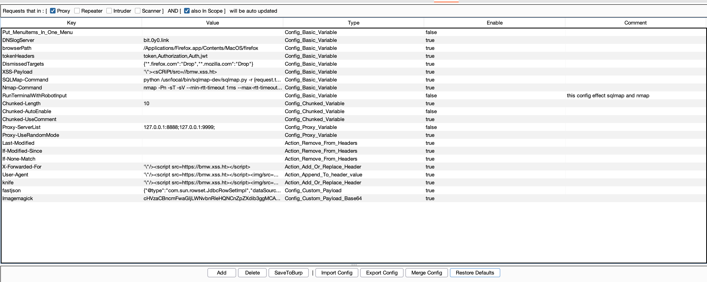

### 2、配置导出（Export Config）

将当前配置保存到JSON文件。当自己完成满意的配置后，建议及时进行保存备份。


### 3、配置导入（Import Config）

导入配置会将当前配置完全清空，完全使用新文件中的配置。

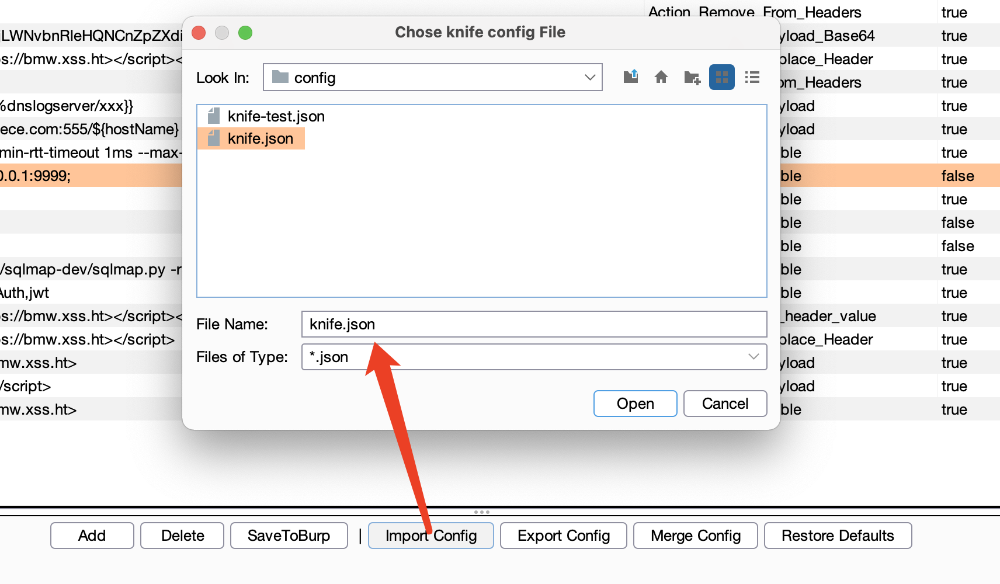

### 4、配置合并（Merge Config）

当更新插件时（使用新的版本），建议按照如下流程操作：

1、保存旧版本的配置

2、安装新的插件版本

3、点击”Restore Defaults“，将当前配置初始化为默认值。

4、点击”Merge Conig“，选择旧的配置文件进行配置合并。

5、处理冲突值，选择原始项或冲突项进行删除即可，会自动更新。如果没有冲突项，可以不用处理。


### 5、配置缓存 SaveToBurp

将当前配置保存到burp的缓存中，下次启动burp时会自动加载。默认是会自动保存的。

## 欢迎贡献

如果你更好的建议或者意见，欢迎[提交](https://github.com/bit4woo/knife/issues)

## 鸣谢

感谢 [jetbrains](https://www.jetbrains.com/) 的开源License！


