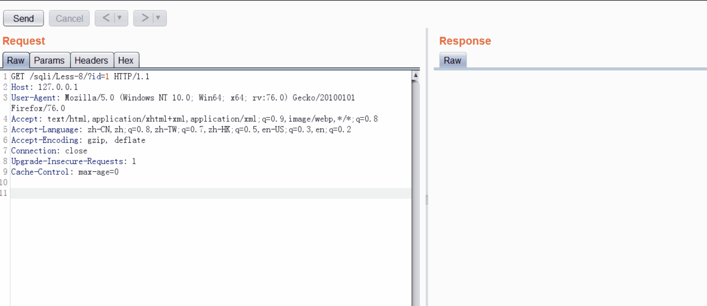

[](https://github.com/ellerbrock/open-source-badges/)  [](https://opensource.org/licenses/mit-license.php)

### [knife](https://github.com/bit4woo/knife) (中文说明请点[这里](https://github.com/bit4woo/knife/blob/master/README-zh.md))

A extension that add some small function[ one key to update cookie, one key add host to scope] to right click context menu.

### Caution

**Please change configurations to yourself payload first before use this tool !!!  especially configurations that type starts with "Action"!!!**

### Video

https://www.bilibili.com/video/bv1BC4y1s7nS

### Authors

[bit4woo](https://github.com/bit4woo)

### Package

```bash
git clone https://github.com/bit4woo/knife
cd knife
mvn package
```

### Functions

##### Menus (simple is beautiful,some menu deleted)

1. update cookie

   update current request cookie which in repeater within the latest cookie fetched from proxy history.

2. add host to scope

   add current request host to burp scope not URL.

3. update header

   update Header that likes token,authorization .

4. open with browser

   open URL of current request or selected URL with browser you configured.

5. Custom Payload

   you can config your own payloads with string or base64 formate.

6. Set Cookie
   scenes: when you visit a website with IP address, It may not contains cookie, but you know it should contains same cookie with some site. you can use this function in Proxy. It will edit response to set the same cookie to let whole web site use the specified cookie.

7. Dismiss

   Dismiss useless requests (eg. *.firefox.com *.mozilla.com) from proxy. see below screen shot to know more.

8. Run SQLMap

   One key to run sqlmap with current selected request.

9. Insert XSS

   One key to insert XSS payload to parameters that not in cookie and not number.

##### Tab

1. U2C

   convert Unicode To Chinese (eg. `\u4e2d\u6587`-->`中文`) 

##### request edit

1. auto remove some headers , eg. Last-Modified,If-Modified-Since,If-None-Match. it's for all requests
2. auto add/update/append some headers, you can control which requests to enable for.
3. use proxy
4. chunked encoding

### Screen shot

update cookie:


update header：


open with browser:


custom payload:


Dismiss:


Run SQLMap:




any issue, advice, suggestion are welcome, Thanks！

### Thanks

Thanks [Jetbrain](https://www.jetbrains.com/) for Open Source license

